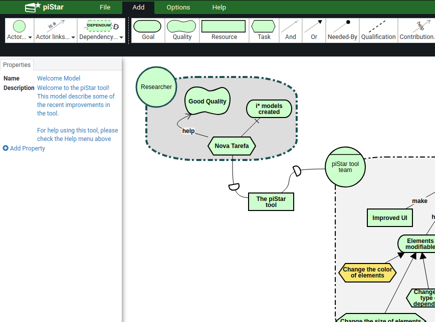
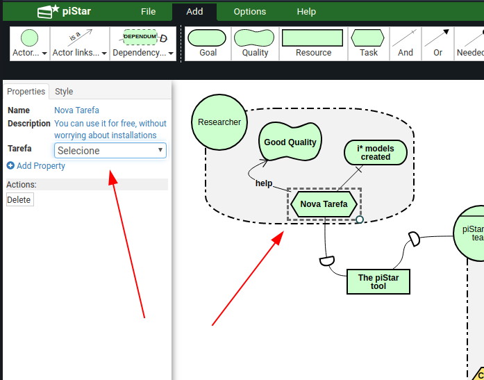
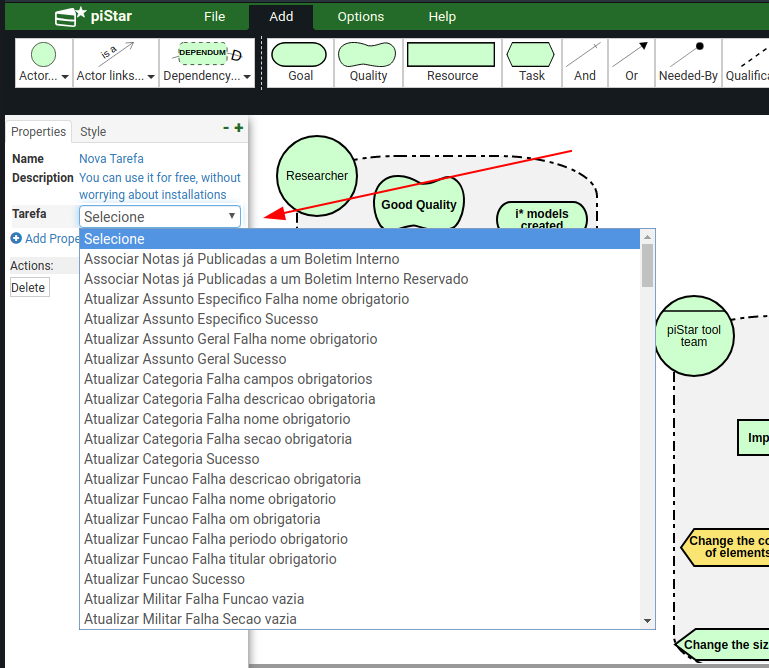
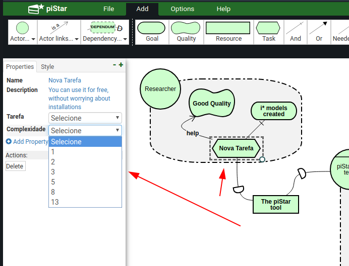

# Passo a passo de instalação e um pouco do funcionamento

__Observação Importante:__ O procedimento abaixo leva em consideração que a ferramenta vai rodar num servidor GNU/linux, ou seja, os comandos abaixo listados são para distribuições Linux, usando a distribuição Ubuntu como exemplo.

##Instalação do Apache HTTP Server:

Para instalar o servidor HTTP, execute o comando abaixo. Lembre-se que a senha de administrador do sistema é necessária para executar o comando:

```shellscript
apt install apache2
```

Agora, assumindo que você já tenha o servidor HTTP (Apache HTTP Server) com serviço em funcionamento, faça uma clonagem do repositório do projeto com o comando:
 
```
git clone https://github.com/lealfb/bdd2Goal.git
```
Uma vez baixado o repositório, faça uma cópia do diretório "tool" e todos seu conteúdo para a diretório de execução do Apache. Por padrão no Ubuntu, o diretório fica localizado no endereço abaixo: 

> /var/www/html 

Caso tenha outra configuração no seu servidor HTTP, altere o destino conforme necessário para o seu sistema.
 
 ```
 cp -R bdd2Goal/tool /var/www/html/pistar
 ```
 
 Lembre-se que você deve ter permissão para copiar o diretório (usuário root). E após copiar o diretório, é importante também definir as permissões de leitura e escrita para o mesmo.
 
 ```
 chown -R www-data:www-data /var/www/html/pistar
 ```
 
 ## Notas Importantes
 
 Com base no projeto original, foi desenvolvido um plugin, localizado no endereço do projeto abaixo:
 
 > app/ui/pistar_plugin.js
  
 Neste arquivo estão contidas novas funções as quais sobreescrevem o funcionamento original do piStar. o qual é responsável por carregar a lista de tarefas.
 
 Além do arquivo de plugin, também existe um novo diretório chamado "json", o qual contém diversos arquivos JSON que é a base para funcionamento do novo tipo de propriedade contendo as taferas. Um novo script de plugin sobre-escreve as propriedades do funcionamento original do piStar e carrega valores pré-definidos desse diretório contendo os arquivos JSON.
 
 Com o serviço em execução, acesse o endereço do servidor, como no exemplo abaixo:
 
 http://localhost/pistar
 
 O sistema deve apresentar a página de entrada.
 
 
 
 
 Ao selecionar uma tarefa (objeto task), e adicionar um novo atributo de nome "feature", o sistema deve mostrar ao invés de um campo livre, um campo de seleção única contendo a lista carregada a partir do diretório __json__ na raiz do projeto, conforme a imagem abaixo. Adicionalmente, nesse Fork o sistema abrirá ainda os seguintes campos: benefit, penalty, cost, risk. Esses campos só precisam ser utilizados no caso do uso de módulo de prioridade


 
 
 
 
Ao adicionar uma nova propriedade num objeto do tipo "Tarefa (Task)", deverá aparecer um menu contendo as tarefas pre-definidas do diretório contendo os diversos arquivos JSON.



Adicionando mais um novo atributo, o sistema irá adicionar um novo combobox contendo uma lista de nível de complexidade.



## Como funciona o plugin

Primeiramente, o plugin inicia uma requisição Ajax para listar o diretório JSON do pistar, com a função abaixo:

```javascript
$.ajax({
    url: "json/",
    success: function (data) {
	$(data).find("a").each(function (a, b) {
	    if (/.+\.json/.test(b.href)) {
		var href = b.href;
		var base = href.replace(/\/[a-f|A-F|0-9]+.json$/, '');
		var href = href.replace(base, '');
		fList.push('json' + href);
	    }
	});
    }
});

function loadNames() {
    fList.forEach(function (jsonFile) {
	$.getJSON(jsonFile, function (data) {
	    titulos.push(data.name);
	});
    });
}

```
Uma das necessidades de utilizar o servidor HTTP em execução é para poder listar o diretório com os arquivos de forma remota, sem violar as restrições do protocolo SOAP. Após ser feita a requisição, cada arquivo JSON do diretório é aberto e lido para armazenar o atributo __"name"__ do mesmo, o qual é a lista de tarefas predifinida no projeto.


## Sobreescrevendo o código original do piStar

No trecho javascript abaixo, começamos a sobreescrever o código original do piStar com o funcionamento necessário. Foi utilizada essa abordagem para não alterar a estrutura original do projeto e flexibilizar a possibilidade de atualização de código sem alterar o código fonte original do projeto base. Como podemos ver, é um atributo do objeto do piStar recebendo uma nova função como atributo, realizando assim a sobre-escrita.

```javascript
ui.components.PropertiesTableView.prototype.renderCustomProperty = function (propertyName) {

    console.log(this.model.attributes.type);
    
    if (this.model.attributes.type == 'Task') {

	var customProperties = this.model.attributes.customProperties;

	var keys = Object.keys(customProperties);
	
	var customTemplate = null;

	switch (keys.indexOf(propertyName)) {
	    case 1:
		customTemplate = renderCustomPropertyTemplate(propertyName, this.model.prop('customProperties/' + propertyName));
		break;
	    case 2:
		customTemplate = renderComplexityTemplate(propertyName, this.model.prop('customProperties/' + propertyName));
		break;
	    default:
		customTemplate = this.template({
		    propertyName: propertyName,
		    propertyValue: this.model.prop('customProperties/' + propertyName),
                    dataType: 'textarea'
		});
	}


    } else {
        
        this.$table.find('tbody').append(this.template({
            propertyName: propertyName,
            propertyValue: this.model.prop('customProperties/' + propertyName),
            dataType: 'textarea'
        }));
    }

    this.$table.find('tbody').append(customTemplate);
};
```


## Módulo de Priorização

Um módulo de cálculo de prioridade foi adicionado ao trabalho no presente Fork.

### Modelagem para o módulo de priorização

Para modelar o modelo para ser utilizado com o módulo de priorização por favor considere além do já mencionado acima as seguintes regras de nomenclatura

- Para Goals: Todo nome deve começar com G seguido de um número índice. Os índices começam em 1 e vão aumentando, os índices são globais. Para Goals filhos de um mesmo pai, os Goals cujos índices são menores são considerados como dependências. Ou seja, se G1 e G2 são filhos de G0, G1 **deve** ser cumprido antes de G0
- Para Tasks: Similarmente a Goals as Tasks devem começar com T seguido de um índice. Porém os índices de Tasks são locais, ou seja, G1 pode possuir tasks T1 e T2 e G2 também pode possuir tasks cujos nomes começam com T1 e T2.
- **Notação de Paralelismo**: Como visto, por padrão a ferramente considera que Tasks e Goals de índices menores são dependências dos índices seguintes. Caso queira remover essa consideração e ordenar as Tasks ou Goals por prioridade use a notação (X1#X2#X3) ao final da descrição do elemento, exemplo: G0: Criar Secretária (G1#G2)

### O cálculo

O primeiro passo para utilizar o módulo de prioridade é preencher os campos benefit, penalty, cost, risk com valores de 1-9, segue uma pequena explicação de cada campo:

- **benefit**: Medida do quanto a tarefa influi positivamente no sistema, onde 1 a tarefa traz pouquíssimo valor ao projeto; 9 a tarefa agrega muito valor ao projeto, provavelmente é muito importante para o objetivo principal

- **penalty**: São penalidades que a falta da tarefa pode incluir no sistema, onde 1 é nenhuma penalidade e 9 é uma penalidade muito séria. Por exemplo, uma tarefa relacionada à segurança de um sistema de pagamento, ou a um requisito que existe para seguir leis governamentais, pode não ter um benefício alto, mas tem uma penalidade muito alta caso não cumprida

- **cost**: Envolve a complexidade da tarefa, exemplo, se a tarefa precisa de muitos cenários de teste, se os designs e códigos usados podem ser reutilizados, etc.

- **risk**: Mede o risco técnico da tarefa, onde 1- você faz essa tarefa até de olhos fechados e 9 - você nao sabe por onde começar, as tecnologias utilizadas são desconhecidas pela equipe, a pessoa que normalmente seria responsável esta incapacitada e etc

Idealmente os campos benefit e priority devem ser preenchidos com o auxílio de alguém do time de negócios enquanto cost e risk devem ser preenchidos pelo time de desenvolvimento.

Uma vez que esses campos estão preenchidos é possível modificar os pesos de cada campo (onde cada campo tem peso 1 por definição) e calcular a prioridade de cada Task (e seus respectivos testes de BDD) no menu Help.


### Caminhos de Desenvolvimento

Também é possível gerar uma sugestão de Sequências de Desenvolvimento baseada na relação de dependências entre tarefas e nas prioridades. Para isso, é necessário primeiro fazer o processo de priorização. 

__Observação Importante:__ É aqui que a notação de paralelismo é utilizada se necessária.

Para fazer o cálculo dos caminhos basta acessar o menu Help e clicar em Calcular Sequência de Desenvolvimento. Isso abre uma modal com várias sugestões que seguem o caminho do grafo. O que está em vermelho são Goals e Tasks não cumpridas e em verde são já cumpridas.


Ao clicar em Baixar Informação Cenários, caso haja tasks não cumpridas o usuário recebe um JSON contendo as informações dos cenários com status Skipped ou Failed.
